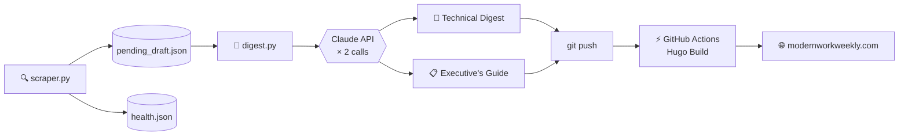

**A self-hosted, fully automated Microsoft 365 change digest.**  
Scraped from 15+ Microsoft portals · Drafted by Claude · Published every Tuesday

---

---

## Contents

- [What this is](#what-this-is)
- [⚙️ How it works](#️-how-it-works)
- [🔍 Sources scraped](#-sources-scraped)
- [📁 Repository layout](#-repository-layout)
- [🛠️ Tech stack](#️-tech-stack)
- [📋 Requirements](#-requirements)
- [☕ Support](#-support)

---

## What this is

**Modern Work** is Microsoft's framework for secure, cloud-connected productivity — built around Microsoft 365 and the **Zero Trust** security model. Modern Work engineers are responsible for the full stack: identity (Entra ID), device compliance (Intune), data protection (Purview), threat detection (Defender), and network access (Global Secure Access).

Microsoft ships updates across all of it continuously. **Modern Work Weekly** scrapes the official portals, uses the Claude API to draft a structured digest, and publishes it every Tuesday — so engineers can stay current without manually tracking across portals.

A companion **Executive's Guide** is generated alongside each digest — plain-language briefings for leadership, compliance officers, and IT directors.

No marketing. No filler. Operational signal only.

---

## ⚙️ How it works

Two cron jobs run on a self-hosted LXC:

| Schedule | Script | What it does |
|---|---|---|
| **Every Tuesday 5:55 AM CST** | `weekly-run.sh` | Full pipeline — scrape → draft → push |
| **Every 8 hours** | `health-run.sh` | Known issues only → push if changed |

> [!NOTE]
> **Rolling draft:** The scraper accumulates new items into `pending_draft.json` across every run. When Tuesday fires, it consumes everything since the last publish — nothing gets lost between runs.

---

## 🔍 Sources scraped

| Category | Sources |
|---|---|
| 🪪 Identity & Access | Entra ID |
| 💻 Endpoint Management | Intune, Autopilot, Windows 365 |
| 🛡️ Security | Defender XDR, Defender for Endpoint, Defender for Office 365 |
| 💬 Collaboration | Teams, SharePoint / OneDrive, Exchange Online |
| 🗄️ Data | Purview |
| 🌐 Network | Global Secure Access |
| 📊 Cross-platform | Microsoft 365 Roadmap, Microsoft Security Blog |
| 🩺 Known Issues *(every 8h)* | Intune, Autopilot, Windows 365, Defender for Endpoint, Defender XDR, Purview, Entra ID, Teams, Windows Release Health |

---

## 📁 Repository layout

<strong>scraper/</strong> — Data collection and digest drafting

| File | Description |
|---|---|
| `scraper.py` | Fetches all portals, deduplicates against `seen_items.json`, appends to rolling draft |
| `digest.py` | Reads `pending_draft.json`, calls Claude API (×2), writes Hugo posts, archives draft |
| `sources.py` | Source URLs, RSS feeds, CSS selectors, and health-check flags for all portals |
| `weekly-run.sh` | Tuesday cron entrypoint — pull → scrape → draft → push |
| `health-run.sh` | 8-hour cron entrypoint — health sources only → push if changed |

<strong>state/</strong> — Persisted on LXC, gitignored

| File | Description |
|---|---|
| `pending_draft.json` | Rolling accumulator — items build across runs, cleared after each publish |
| `seen_items.json` | Dedup tracker — SHA-256 hashes of all previously seen items |
| `weekly_draft_*.json` | Per-run snapshots retained for reference |
| `archive/` | Pending drafts archived after each publish |

<strong>site/</strong> — Hugo static site

| Path | Description |
|---|---|
| `content/posts/` | Weekly technical digest posts (one `.md` per week) |
| `content/exec/` | Executive's Guide posts (generated alongside each digest) |
| `data/health.json` | Known issues — rendered in left sidebar, refreshed every 8 hours |
| `data/deadlines.json` | Zero Trust deadline calendar |
| `layouts/` | Hugo templates — 3-column digest layout with sticky sidebars |
| `static/css/` | Custom dark-mode styles |
| `static/js/` | Collapsible sections, calendar logic, admin portal links |

<strong>infra/</strong> — Infrastructure configuration

| File | Description |
|---|---|
| `lxc/bootstrap.sh` | Fresh Ubuntu 24.04 LXC setup — installs all dependencies |
| `caddy/Caddyfile` | Caddy reverse proxy config |
| `cloudflare/tunnel.yml` | Cloudflare Tunnel config reference |

<strong>docs/</strong> — Reference documentation

| File | Description |
|---|---|
| `SETUP.md` | Full initial setup guide — LXC to live site |
| `WEEKLY_WORKFLOW.md` | Weekly pipeline reference and troubleshooting |
| `PIPELINE.md` | Claude API and digest pipeline internals |

---

## 🛠️ Tech stack

| Component | Tool |
|---|---|
| Hosting | Ubuntu 24.04 LXC (Proxmox) |
| Web server | Caddy |
| Tunnel | Cloudflare Tunnel → `modernworkweekly.com` |
| Static site | Hugo v0.128+ |
| Scraper | Python 3.12 — requests, BeautifulSoup, feedparser |
| Digest drafting | Claude API (`claude-sonnet-4-6`) |
| CI/CD | GitHub Actions |

---

## 📋 Requirements

- Python 3.12+ with dependencies from `scraper/requirements.txt`
- `ANTHROPIC_API_KEY` stored in `/opt/modern-work-weekly/.env` on the LXC

> [!IMPORTANT]
> The API key is never committed to the repo. Store it only in `/opt/modern-work-weekly/.env` on the LXC with `chmod 600`.

- Hugo Extended v0.128+
- Cloudflare Tunnel configured for your domain

See [`docs/SETUP.md`](docs/SETUP.md) for the full walkthrough.

---

## ☕ Support

This project is free and open. If it saves you time, [contributions on Ko-fi](https://ko-fi.com/ryanarbuckle) help offset the API costs and keep it running.
