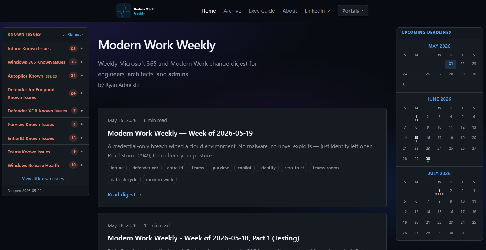
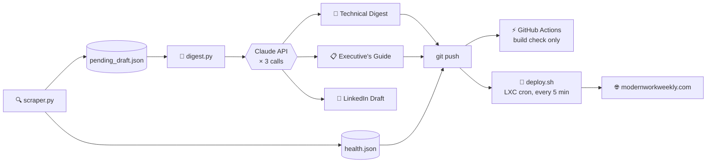

**A self-hosted, fully automated Microsoft 365 change digest.**  
Scraped from 30+ Microsoft sources · Drafted by Claude · Published every Tuesday

---

---

## What this is

**Modern Work** is Microsoft's umbrella for identity and access, endpoint and device management, collaboration and productivity, AI and Copilot, employee experience, and security and compliance. Microsoft ships updates across all six continuously.

**Modern Work Weekly** scrapes the official portals across all six, uses the Claude API to draft a structured digest, and publishes it every Tuesday — so engineers can stay current without manually tracking a dozen portals.

A companion **Executive's Guide** is generated alongside each digest — plain-language briefings for leadership, compliance officers, and IT directors. A **LinkedIn newsletter draft** is also produced, ready to post.

No marketing. No filler. Operational signal only.

---

## ⚙️ How it works

`git push` triggers two independent things: GitHub Actions runs a build check (does `hugo --minify` still succeed?) and stops there — it does **not** deploy. The actual publish path is pull-based: a cron on the LXC itself polls GitHub and does the real build + deploy, entirely separate from GitHub Actions.

Three cron jobs run automatically on a self-hosted LXC:

| Schedule | Script | What it does |
|---|---|---|
| **Every 5 min** | `deploy.sh` | Git pull → if new commits, Hugo build → deploy. No-op (near-instant) if nothing changed. |
| **Tuesday mornings** | `weekly-run.sh` | Full scrape → Claude draft → push |
| **Every 8 hours** | `health-run.sh` | Known issues refresh + deadline purge → push if changed |

> [!NOTE]
> **Rolling draft:** The scraper accumulates new items into `pending_draft.json` across every run since the last publish. When Tuesday fires, it consumes everything accumulated — nothing gets lost between runs.

> [!NOTE]
> **Why polling instead of a webhook:** the LXC has zero inbound ports open — Cloudflare Tunnel only makes outbound connections, by design. A webhook-triggered deploy would need an inbound endpoint to receive it, which breaks that model. Polling every 5 minutes keeps deployment entirely pull-based, at the cost of up to a 5-minute publish delay — a deliberate tradeoff, not an oversight.

---

## 🔍 Sources scraped

| Category | Sources |
|---|---|
| 🪪 Identity & Access | Entra ID |
| 💻 Endpoint & Device Management | Intune, Autopilot, Windows 365, Windows Autopatch |
| 💬 Collaboration & Productivity | Teams, SharePoint / OneDrive, Exchange Online |
| 🤖 AI & Copilot | Microsoft 365 Copilot, Copilot Studio, Agent 365, Power Platform |
| 🌱 Employee Experience | Microsoft Viva |
| 🛡️ Security & Compliance | Defender XDR, Defender for Endpoint, Defender for Identity, Defender for Office 365, Microsoft Security Response Center, Purview, Global Secure Access, Microsoft Security Blog |
| 📊 Spans multiple pillars | Microsoft 365 Roadmap, Microsoft Mechanics |
| 🩺 Known Issues *(every 8h)* | Intune, Autopilot, Windows 365, Defender XDR, Purview, Entra ID, Windows Release Health, Azure Status, M365 Service Status |

---

## 📁 Repository layout

<strong>scraper/</strong> — Data collection and digest drafting

| File | Description |
|---|---|
| `scraper.py` | Fetches all sources via RSS, JSON API, or HTML scraping; deduplicates; appends to rolling draft; refreshes `health.json` and `deadlines.json` |
| `digest.py` | Reads `pending_draft.json`, calls Claude API (×3) for technical digest, Executive's Guide, and LinkedIn draft; updates health baseline |
| `sources.py` | Source definitions — URLs, RSS feeds, health flags, and per-source scraping hints |
| `deploy.sh` | Pulls latest commits, rebuilds Hugo, and rsyncs to the web root |
| `weekly-run.sh` | Tuesday cron entrypoint — scrape → draft → push → build & deploy |
| `health-run.sh` | 8-hour cron entrypoint — health sources + deadline purge → push if changed |

<strong>state/</strong> — Persisted on LXC, gitignored

| File | Description |
|---|---|
| `pending_draft.json` | Rolling accumulator — items build across runs, cleared after each publish |
| `seen_items.json` | Dedup tracker — SHA-256 hashes of all previously seen items |
| `health_baseline.json` | Known issue titles at last digest publish — used to diff what's new since last week |
| `weekly_draft_*.json` | Per-run snapshots retained for reference |
| `archive/` | Pending drafts archived after each publish |

<strong>site/</strong> — Hugo static site

| Path | Description |
|---|---|
| `content/posts/` | Weekly technical digest posts (one `.md` per week) |
| `content/exec/` | Executive's Guide posts (generated alongside each digest) |
| `data/health.json` | Known issues with `is_new` diff flags — homepage shows all, digest pages show new-only |
| `data/deadlines.json` | Key dates calendar — auto-purged of expired entries every 8 hours |
| `layouts/` | Hugo templates — 3-column digest layout with context-aware sidebars |
| `static/css/` | Custom dark-theme styles |
| `static/js/` | Collapsible sections, calendar logic, admin portal links |

<strong>linkedin/</strong> — LinkedIn newsletter formatting reference

| File | Description |
|---|---|
| `template.md` | Article-format reference for posting the weekly LinkedIn newsletter edition |
| `formatter.py` | Standalone CLI tool that converts a Hugo digest post (`site/content/posts/*.md`) into a plain-text, LinkedIn-ready paste with emoji section markers and a hashtag block |

<strong>infra/</strong> — Infrastructure configuration

| File | Description |
|---|---|
| `lxc/bootstrap.sh` | Fresh Ubuntu 24.04 LXC setup — installs all dependencies |
| `caddy/Caddyfile` | Caddy reverse proxy config (serves on :8080 behind Cloudflare Tunnel) |
| `cloudflare/tunnel.yml` | Cloudflare Tunnel config reference |

<strong>docs/</strong> — Reference documentation

| File | Description |
|---|---|
| `SETUP.md` | Full initial setup guide — LXC to live site |
| `WEEKLY_WORKFLOW.md` | Weekly pipeline reference and troubleshooting |
| `PIPELINE.md` | Claude API and digest pipeline internals |

---

## 🛠️ Tech stack

| Component | Tool |
|---|---|
| Hosting | Ubuntu 24.04 LXC (Proxmox) |
| Web server | Caddy |
| Tunnel | Cloudflare Tunnel → `modernworkweekly.com` |
| Static site | Hugo v0.128+ |
| Scraper | Python 3.12 — requests, BeautifulSoup, feedparser |
| Digest drafting | Claude API (`claude-sonnet-4-6`) |
| CI | GitHub Actions — build check only (`hugo --minify` on push); deploy is pull-based via the LXC cron above, not GitHub Actions |

---

## 📋 Requirements

- Python 3.12+ with dependencies from `scraper/requirements.txt`
- `ANTHROPIC_API_KEY` stored in `/opt/modern-work-weekly/.env` on the LXC

> [!IMPORTANT]
> The API key is never committed to the repo. Store it only in `/opt/modern-work-weekly/.env` on the LXC with `chmod 600`.

- Hugo Extended v0.128+
- Cloudflare Tunnel configured for your domain

---

## ☕ Support

This project is free and open. If it saves you time, [contributions on Ko-fi](https://ko-fi.com/ryanarbuckle) help offset the API costs and keep it running.
